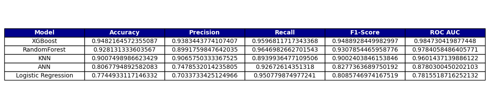

# Machine Learning Analysis of Factors Influencing Mammography Uptake

## Project Overview

This project utilizes machine learning techniques to identify and analyze key factors influencing mammography screening utilization. The study is based on data from the Medical Expenditure Panel Survey (MEPS) for the years 2019-2022. The primary objective is to understand how demographic, socioeconomic, and health expenditure-related factors contribute to an individual's decision to undergo mammography. The analysis considers both male and female respondents, with sex included as a predictive feature.

The insights derived aim to inform public health strategies for promoting early breast cancer detection through increased screening rates. The full analysis and code are available in the Jupyter Notebook: `ML for Mammography Franchise Impact.ipynb`.

## Dataset

* **Source:** Medical Expenditure Panel Survey (MEPS), 2019-2022.
* **Target Variable:** `MAMMOG_M18` (a binary indicator: 1 if a mammogram was received, 0 otherwise - original values 1 and 2 were mapped).
* **Features Used for Modeling:**
    1.  `AGE`
    2.  `SEX` (1 for male, 0 for female - mapped from original values)
    3.  `INSAT` (insurance status: 1 = yes, 2 = no, -1 = inapplicable)
    4.  `POVCAT` (income category: 1 = poor, 2 = near poor, 3 = low income, 4 = middle income, 5 = high income)
    5.  `TOTSLF` (total annual self-reported out-of-pocket health expenditures)
    6.  `TOTEXP` (total annual health expenditures)

*(Note: While feature engineering (e.g., log transformations, age groups, cost ratios) was explored during EDA, the final models were trained on the six original features listed above.)*

## Methodology

The project followed a structured data science pipeline:

1.  **Data Ingestion & Preparation:** Loading the combined MEPS dataset (`mammo_combined_2018_2022.csv`), initial data checks, and filtering for valid target variable entries.
2.  **Exploratory Data Analysis (EDA):** Visualization of feature distributions and their relationships with mammography uptake. (Note: EDA included exploration of engineered features like `TOTSLF_log`, `TOTEXP_log`, `RATIO_SLF_EXP`, and `AGE_GROUP` on a female-only subset, but these were not used in the final modeling stage.)
3.  **Data Preprocessing for Modeling:**
    * Mapping `SEX` and `MAMMOG_M18` to numerical representations (0 and 1).
    * Splitting data into training (80%) and testing (20%) sets using the original six features.
    * Scaling numerical features using `StandardScaler`.
    * Addressing class imbalance in the training data with `SMOTE`.
4.  **Model Development & Evaluation:**
    * Five classification algorithms were implemented and evaluated:
        * K-Nearest Neighbors (KNN)
        * Neural Network Classifier (ANN)
        * Random Forest
        * Logistic Regression
        * XGBoost Classifier
    * Performance was assessed using Accuracy, Precision, Recall, F1-Score, and ROC AUC. Confusion matrices and ROC curves were generated for each model using a standardized evaluation function.
5.  **Feature Importance Analysis:** Feature importance scores were extracted from the RandomForest and XGBoost models based on the six input features.

## Key Results & Model Performance

All five implemented models were evaluated on the test set. The XGBoost classifier and RandomForest classifier demonstrated superior performance.

**Performance Summary of All Evaluated Models:**


The **XGBoost model** yielded the highest ROC AUC (0.9847) and F1-Score (0.9489).

**XGBoost Model - Confusion Matrix:**


The **RandomForest model** yielded the highest ROC AUC (0.9784) and F1-Score (0.93).

**RandomForest Model - Confusion Matrix:**


### Most Influential Features (Based on the 6 original features used for modeling)

The feature importance analysis from XGBoost and RandomForest models, using the six original input features, provided the following insights:

**Key Features from XGBoost (Top 6 shown):**


**Key Features from RandomForest (Top 6 shown):**


**Corrected Interpretation of Feature Importances based on your code (using the 6 original features: `AGE`, `SEX`, `INSAT`, `POVCAT`, `TOTSLF`, `TOTEXP`):**

* **`SEX`** is unequivocally the most critical factor in both models.
* **`TOTSLF` (Out-of-Pocket Costs)** and **`TOTEXP` (Total Expenditures)** are highly influential, indicating the strong role of financial aspects.
* **`POVCAT` (Income Level)** and **`INSAT` (Insurance Status)** also demonstrate significant importance, highlighting socioeconomic determinants.
* **`AGE`** is also a predictor, its importance varying between the two models.

## Conclusion

This machine learning analysis of MEPS data successfully identified key determinants of mammography screening. Among the five algorithms evaluated, **XGBoost and RandomForest demonstrated the strongest predictive capabilities**, with XGBoost achieving a slightly higher ROC AUC.

The most significant factors influencing mammography utilization were consistently identified as **age, total out-of-pocket health expenditures, total health expenditures, income level (poverty category), insurance status, and sex**.

The findings underscore that mammography utilization is influenced by a complex interplay of these core factors. While direct "insurance franchise" data was not part of the input features, the importance of out-of-pocket costs (`TOTSLF`) and total expenditures (`TOTEXP`) suggests that financial considerations for patients are critical. These insights can aid public health officials and policymakers in developing targeted strategies to reduce barriers and enhance mammography screening rates.

## How to Run

1.  **Clone the repository:**
    ```bash
    git clone <your-repository-url>
    cd <your-project-folder-name>
    ```
2.  **Ensure Python 3.x is installed.**
3.  **Install necessary libraries.** While a `requirements.txt` is not provided with this iteration, the key libraries used are:
    * `pandas`
    * `numpy`
    * `seaborn`
    * `matplotlib`
    * `scikit-learn`
    * `xgboost`
    * `imbalanced-learn`
    * `openpyxl` (for initial data loading if raw Excel files were used, though the notebook uses a pre-combined CSV).
    You can install them using pip:
    ```bash
    pip install pandas numpy seaborn matplotlib scikit-learn xgboost imbalanced-learn openpyxl
    ```
4.  **Dataset:** Place the `mammo_combined_2018_2022.csv` file in the root directory of the project or update the file path in the `ML for Mammography Franchise Impact.ipynb` notebook accordingly.
5.  **Run the Jupyter Notebook:** Open and execute the cells in `ML for Mammography Franchise Impact.ipynb`.