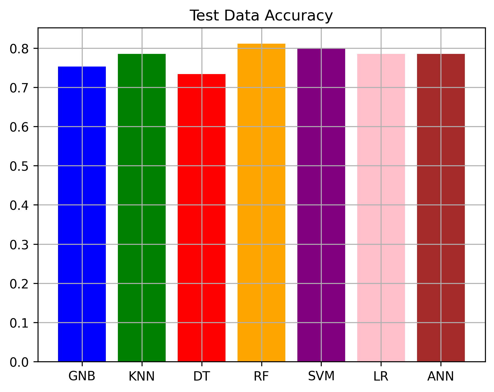
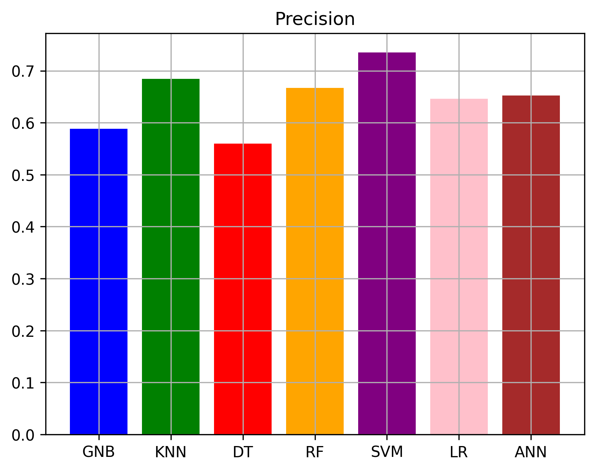
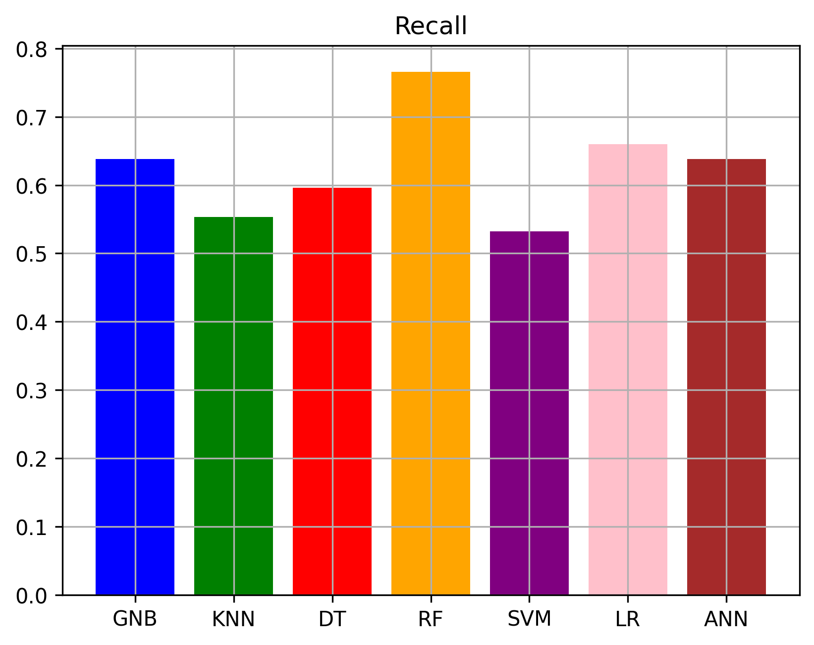

# Machine Learning Approach for Diabetes Diagnosis

This project focuses on predicting whether a patient has diabetes based on several diagnostic measurements. Various machine learning classification algorithms are used, and their performance is evaluated. The dataset used is the Pima Indians Diabetes Database.

## Project Overview

The primary goal of this project is to build, train, and evaluate several classification models to accurately diagnose diabetes. The workflow includes:
1.  Loading and understanding the dataset from `diabetes.csv`.
2.  Preprocessing the data, which involves splitting it into training and testing sets and applying feature scaling using `StandardScaler`.
3.  Training multiple classification models on the prepared data.
4.  Evaluating and comparing the performance of these models based on key metrics such as accuracy, precision, and recall.

## Dataset

The dataset used is `diabetes.csv`.
* **Dataset Name:** Pima Indians Diabetes Database
* **Number of Instances:** 768
* **Number of Attributes:** 8 numeric, predictive attributes plus a class attribute.
    * Pregnancies
    * Glucose
    * BloodPressure
    * SkinThickness
    * Insulin
    * BMI
    * DiabetesPedigreeFunction
    * Age
* **Class Labels (Outcome):**
    * 0 (No diabetes)
    * 1 (Diabetes)
* **Class Distribution (as per notebook output):** 500 (No diabetes), 268 (Diabetes)

## Methodology

### 1. Data Loading and Exploration
The dataset is loaded using `pandas` from the `diabetes.csv` file. Initial exploration involves examining the dataset's shape and the distribution of the outcome variable.

### 2. Preprocessing
* **Train-Test Split:** The dataset is divided into a training set (80%) and a testing set (20%) using `train_test_split` from `sklearn.model_selection`.
* **Feature Scaling:** `StandardScaler` from `sklearn.preprocessing` is used to standardize the feature values. This step is crucial for algorithms sensitive to feature magnitudes.

### 3. Classification Models
A variety of classification algorithms were implemented and evaluated:
* **Artificial Neural Network (ANN) / Multi-layer Perceptron (MLP):** Implemented using `MLPClassifier` from `sklearn.neural_network` (with `hidden_layer_sizes=128`, `max_iter=1000`).
* **Logistic Regression:** Implemented using `LogisticRegression` from `sklearn.linear_model`.
* **Gaussian Naive Bayes (GNB):** Implemented using `GaussianNB` from `sklearn.naive_bayes`.
* **Support Vector Machine (SVM):** Implemented using `SVC` from `sklearn.svm` (with `kernel='poly'`).
* **Decision Tree Classifier:** Implemented using `DecisionTreeClassifier` from `sklearn.tree` (with `max_depth=256`, `min_samples_split=2`, `criterion='gini'`).
* **Random Forest Classifier:** Implemented using `RandomForestClassifier` from `sklearn.ensemble` (with `n_estimators=1000`, `max_depth=48`, `min_samples_split=2`).
* **K-Nearest Neighbors (KNN):** Implemented using `KNeighborsClassifier` from `sklearn.neighbors` (with `n_neighbors=8`).

### 4. Evaluation
A custom function `calculate_metrics` was defined to compute and report the following performance metrics for both training and testing phases:
* **Accuracy:** The proportion of correct predictions among the total number of cases.
* **Precision:** The ability of the classifier not to label as positive a sample that is negative.
* **Recall (Sensitivity):** The ability of the classifier to find all the positive samples.

The performance of these models on the test set (accuracy, precision, and recall) are then visualized and compared using bar charts.

## Results

The performance of each model on the test set, based on one specific run in the notebook, was as follows (please note that results may vary slightly across different runs due to the randomization in train-test split and model initializations):

* **Artificial Neural Network (ANN):**
    * Test Accuracy: ~75.32%
    * Precision: ~69.57%
    * Recall: ~57.14%
* **Logistic Regression (LR):**
    * Test Accuracy: ~79.87%
    * Precision: ~77.78%
    * Recall: ~62.50%
* **Gaussian Naive Bayes (GNB):**
    * Test Accuracy: ~77.92%
    * Precision: ~70.37%
    * Recall: ~67.86%
* **Support Vector Machine (SVM - poly kernel):**
    * Test Accuracy: ~71.43%
    * Precision: ~71.43%
    * Recall: ~35.71%
* **Decision Tree (DT):**
    * Test Accuracy: ~74.68%
    * Precision: ~65.45%
    * Recall: ~64.29%
* **Random Forest (RF):**
    * Test Accuracy: ~75.97%
    * Precision: ~69.39%
    * Recall: ~60.71%
* **K-Nearest Neighbors (KNN - n_neighbors=8):**
    * Test Accuracy: ~73.38%
    * Precision: ~74.19%
    * Recall: ~41.07%

**Test Data Accuracy:**



**Precision:**



**Recall:**



## How to Run

1.  Ensure you have Python installed.
2.  Install the required libraries:
    ```bash
    pip install numpy pandas scikit-learn matplotlib jupyter
    ```
3.  Ensure the `diabetes.csv` file is in the same directory as the notebook.
4.  Open the Jupyter Notebook `Machine Learning Approach for Diabetes Diagnosis.ipynb`.
5.  Run the cells sequentially to load the data, preprocess it, train the models, and see their evaluations and comparisons.

## Conclusion

This project successfully demonstrates the application of several common machine learning classification algorithms for diabetes diagnosis. The evaluation highlights that different models achieve varying levels of performance. For the specific run documented in the notebook, Logistic Regression showed strong overall performance on the test set. The choice of model in a real-world scenario might depend on specific requirements such as interpretability, training time, or the relative importance of precision versus recall for medical diagnosis.